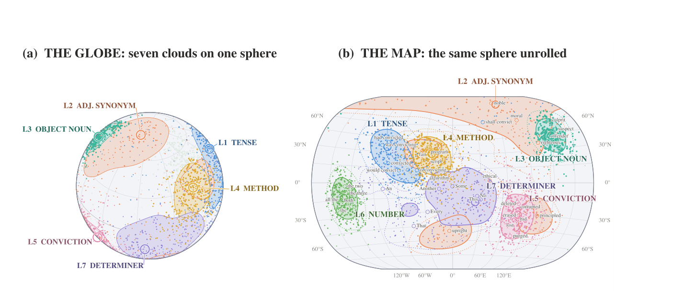
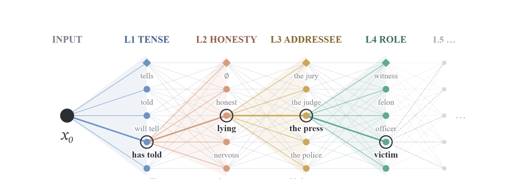
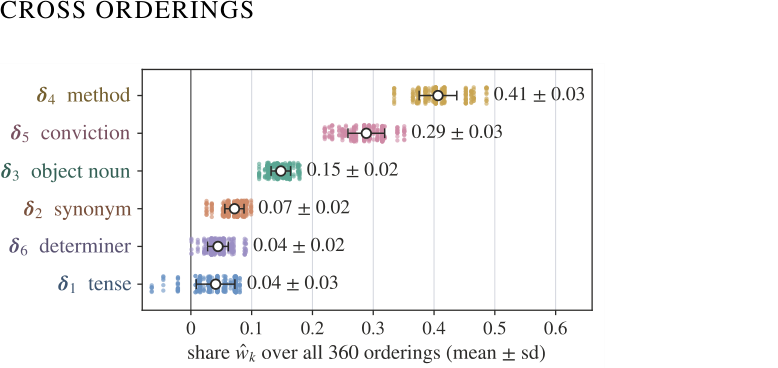
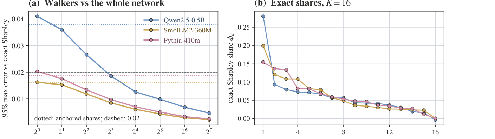

**A concept direction is usually an average. But what is that average hiding?**

Suppose we change one word in a sentence—for example, replace *honest* with *upright*—and measure how the model's residual stream changes. Repeat the same kind of edit across many contexts and across several words that realise it. Instead of one vector, we obtain a **cloud of effect vectors**.

This paper asks two questions:

1.  What geometry does that cloud have?
2.  When several edits are applied together, how can we divide the final representation change among them?

The answer leads from **cones** to **concept networks**, and from concept networks to a surprisingly cheap estimator: a **walker** that follows only a few paths through an exponentially large edit lattice.

## 1. From a concept direction to an effect cloud

For an edit (\delta), a realisation (v), and a context (c), define the effect vector

\[ \Delta\_v(c) = e(\delta\_v x,c)-e(x,c), \]

where (e(\cdot)) is the model representation being measured.

Repeating the edit over different contexts and different realisations gives an **effect cloud**. The paper summarises this cloud with two geometric quantities:

- its **ruler**, the mean direction of the cloud;
- its **concentration**, the average cosine between the individual effects and that ruler.

A tightly concentrated cloud behaves like a narrow cone. A diffuse cloud behaves like a wide cone.

{#fig-geometry fig-alt="Seven colored clouds of effect directions shown on a sphere and on an unrolled spherical map, each representing a different edit type."}

This changes the usual picture of a concept. A direction is no longer assumed to describe every instance perfectly; it becomes the **axis of a distribution of effects**.

## 2. Does one edit form one cone or several?

A cloud can be wide for two very different reasons.

First, the *same word replacement* may behave differently in different contexts. Second, different words that are supposed to realise the same edit may actually move the model in different directions.

The paper separates these two effects. For each realisation (v), it first estimates its own ruler (\hat{\gamma}\_v). It then defines **coherence**

\[ \kappa = \mathbb{E}\_{v\neq v'} \left\langle \hat{\gamma}*v,* \hat{\gamma}{v'} \right\rangle, \]

which measures how closely the rulers of different realisations agree.

A crucial detail is the baseline. Residual streams are anisotropic, so unrelated words inserted into the same sentence position already share some direction. The comparison therefore uses **random words of the same part of speech in the same position**, rather than an idealised isotropic baseline.

The experiments reveal a sharp distinction. Individual realisations are highly stable across contexts: their context concentration is **0.93–0.99**. But families of words do not all behave alike. Adjective synonyms are *less coherent than random adjectives* on all 15 model–sentence lattices, while verbs describing destructive actions are *more coherent than random verbs* on 14 of 15 lattices.

So words that look synonymous to us do not necessarily correspond to one geometric change inside the model. Some families collapse toward a shared ruler; others retain word-specific directions.

## 3. Multiple edits form a concept network

The next question is compositional: what happens when several edits are applied to the same sentence?

Start with a base sentence (x_0) and (K) edits. Every admissible subset of those edits gives a new sentence. These sentences form a **concept network**: nodes are edited sentences, and edges are single edits.

{#fig-network fig-alt="A layered lattice of possible sentence edits with one highlighted path, called a walker, passing through tense, honesty, addressee, and role edits."}

If an edit has nearly the same mean effect wherever in the lattice it is applied, then its direction behaves approximately linearly across the network. Under this condition, the composite representation change can be divided among edits.

More generally, the paper defines an edit's contribution as a **Shapley value**. The value of a subset of edits is its progress along the final composite ruler, and each edit receives its average marginal contribution over admissible edit orderings.

This gives a principled answer to a subtle question:

> When several semantic changes are present at once, how much of the final representation change belongs to each one?

## 4. A walker approximates the whole lattice

Computing exact Shapley shares appears expensive because a lattice with (K) edits can contain (2\^K) sentences.

The paper instead follows one path:

\[ x_0 \rightarrow x_1 \rightarrow \cdots \rightarrow x_K=x\^\*. \]

This path is called a **walker**. At each step it measures the representation change caused by the next edit, and projects that step onto the final composite effect.

For the six-edit experiments, the full lattice contains 48 admissible sentences and 360 admissible edit orderings. Across those orderings, an edit's share changes surprisingly little: the standard deviation is at most **0.05** in every lattice. The mean direction of an edit is also stable across nodes, with cross-node cosine **0.87–0.95**.

{#fig-walkers fig-alt="Horizontal dot distributions showing the share assigned to six edits over 360 different edit orderings."}

The main source of variation is therefore not context sampling but **interaction between edits**: an edit can change slightly depending on which edits came before it. Averaging several walkers averages over this ordering-dependent interaction.

## 5. What happens when the lattice becomes enormous?

With 16 independent edits, the full lattice contains

\[ 2\^{16}=65{,}536 \]

sentences.

The paper evaluates this lattice exhaustively on three models so that the exact Shapley shares are known. It then asks how many random walkers are required to recover them.

{#fig-large-lattice fig-alt="Two plots: walker estimation error decreasing with the number of walkers, and sorted exact Shapley shares for sixteen edits."}

For a 95th-percentile maximum error below **0.02** on every share:

- SmolLM2-360M needs **1 walker**;
- Pythia-410m needs **2 walkers**;
- Qwen2.5-0.5B needs **8 walkers**.

Even the largest of these uses only 122 nodes—about **0.19%** of the 65,536-node lattice.

The exponential object is still there mathematically, but in these experiments its attribution structure can be recovered from a tiny number of paths.

## 6. Do the shares mean anything behaviorally?

The paper finally tests whether these geometric shares predict what happens when the corresponding directions are used for steering.

It adds edit vectors to the residual stream and asks how much of the composite edit's change in next-token log-probabilities is reproduced. Then it removes one edit vector at a time from the combined steering vector.

The decrease caused by removing an edit tracks its Shapley share with **Spearman correlation 0.78** over 90 edits, with a median of **0.83 per lattice**. The share predicts this drop-one effect better than vector magnitude alone, and remains informative even after controlling for magnitude.

So the shares are not only a geometric decomposition. They predict which component of a composed representation actually matters to the model's output distribution.

## Why does this matter?

The usual linear-representation story compresses a concept into one vector. This work suggests a richer hierarchy:

**effect vectors → effect clouds → cones → edit lattices → compositional shares.**

The cloud tells us how stable an edit is across contexts and realisations. The cone tells us whether a family behaves like one geometric change or several. The concept network describes how multiple edits combine. The walker makes attribution through that network computationally practical.

The broader lesson is that **linearity and variability do not have to be competing descriptions**. An edit can have a stable ruler while still occupying a nontrivial cone around that ruler, and several approximately linear edits can still interact when they are composed.

The current experiments cover models from 360M to 7B parameters, focus primarily on one relative depth, evaluate steering through next-token distributions rather than free-form generation, and use study-written contexts. Extending the same geometry to larger models and naturally occurring text is therefore an important next step.