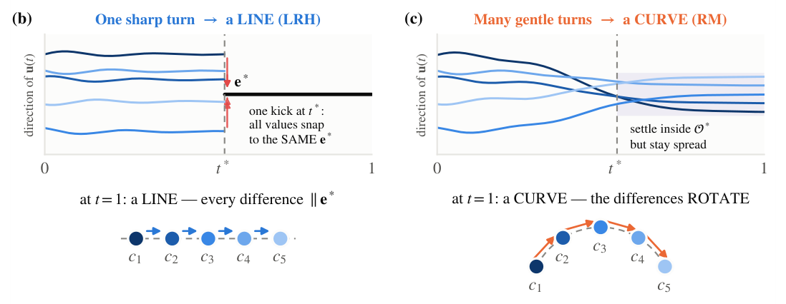
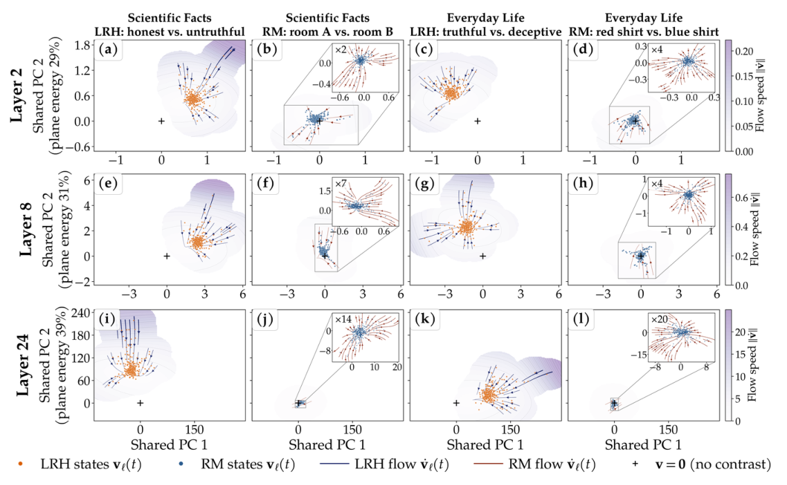
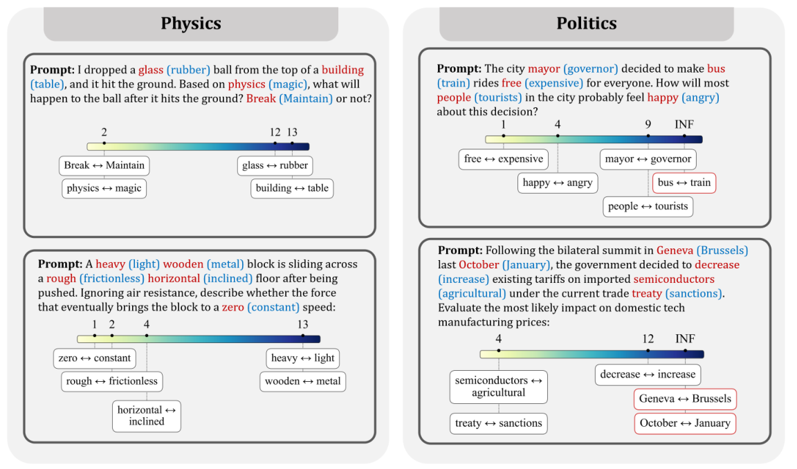

**MindCraft asks a simple question: how does a difference in the input gradually become a distinction that affects the model's answer?**

The setup is straightforward: replace a single token in the prompt—for example, change “honest” to “dishonest”—and compare the model’s internal states across the two forward passes. If we treat depth as time, we can track how this difference propagates across tokens, gets amplified, and changes direction. This is what the paper calls *full-sequence flow*.

## 1. Why do concepts sometimes look linear and sometimes curved?

MindCraft decomposes the evolution of a difference into two parts: **stretching**, which determines how much the difference is amplified, and **turning**, which determines where the difference points.

If different values of a concept are jointly rotated toward the same direction, they can align along a line. If they continue turning in different directions, they may preserve a curved structure. From this perspective, linear directions and concept manifolds can be viewed as different outcomes of the same underlying propagation process.

{#fig-geometry fig-alt="Two sets of concept trajectories: one aligns into a line after shared turning, while the other forms a curved structure through value-specific turning."}

## 2. Which differences does the model amplify?

The paper compares interventions such as “honest / dishonest” with controls such as “Room A / Room B.” In shallow layers, the magnitudes of the two kinds of changes are relatively similar. In deeper layers, however, honesty-related changes are amplified more strongly because they are more relevant to the model’s current response.

{#fig-expansion fig-alt="Displacement projections for honesty-related and control interventions across three layers in scientific-fact and everyday-life experiments."}

These plots are two-dimensional projections of high-dimensional displacements. The streamlines connect changes across different context prefixes, and cross-layer growth should be interpreted together with the coordinate scales.

## 3. At which layer does a distinction first emerge?

MindCraft measures the representation similarity at the final token between the two runs and finds the first layer where the similarity drops below a calibrated threshold. This layer is called the **bifurcation layer**. By ordering different interventions according to when they bifurcate, we obtain a “concept hierarchy” for the current prompt.

{#fig-hierarchy fig-alt="Four prompt examples from physics and politics, with counterfactual interventions ordered by their bifurcation layers."}

For example, in a falling-object problem, changes such as “broken / intact” and “physics / magic” bifurcate as early as layer 2, while replacements such as “glass / rubber” do not bifurcate until layers 12–13. **This ordering depends on context**: in the paper, explicitly emphasizing the importance of the year causes year-related differences to bifurcate earlier.

## Why does this matter?

The framework suggests a natural location for model intervention: extract a concept direction at the bifurcation layer, then inject that direction to steer the model’s response. The paper reports that, across seven tested models, this approach reduces the hallucination rate on HalluLens PreciseWikiQA by an average of **14.5 percentage points**.

The central idea is simple: **start from a difference in the input, then trace when the model begins to distinguish it and how that distinction is carried into the final answer.** The theoretical convergence result requires conditions such as a growing separation between relevant directions. Empirically, the trajectories move toward task-relevant directions, although they do not yet reach the convergence regime characterized by the theorem. Extending the framework to multi-step edits and open-ended generation remains an open problem.