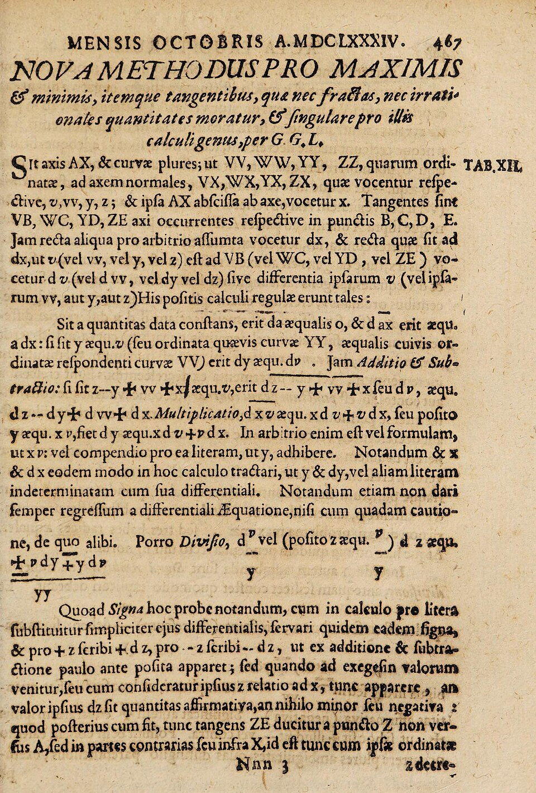
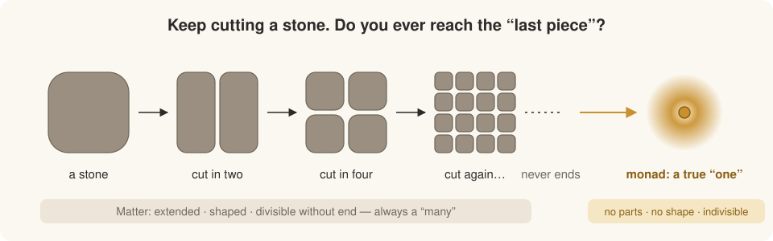
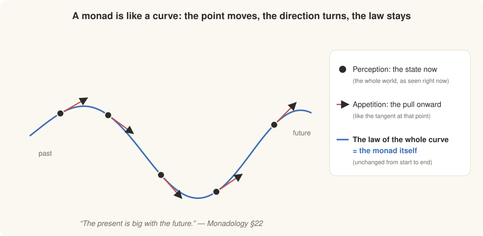
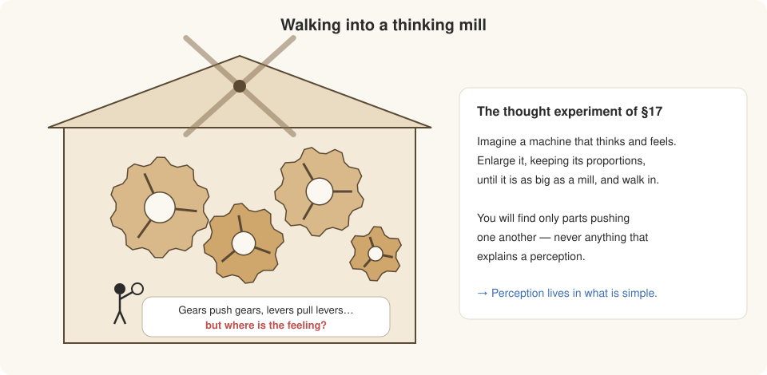
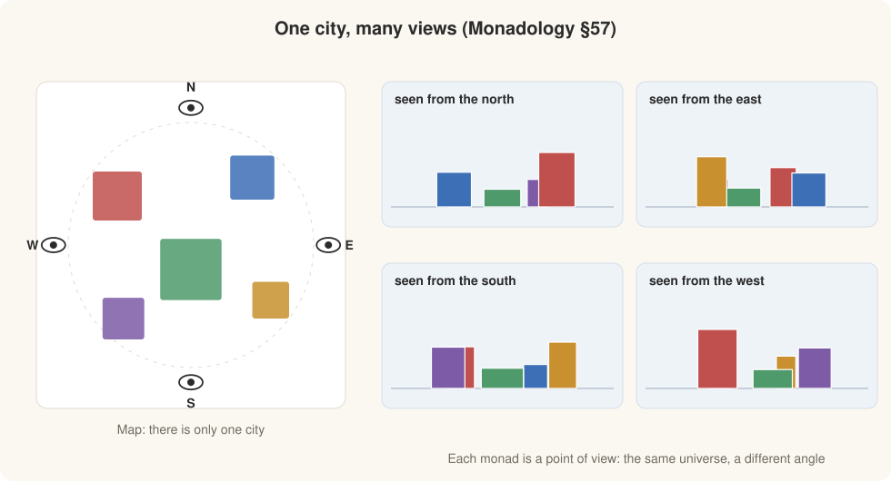
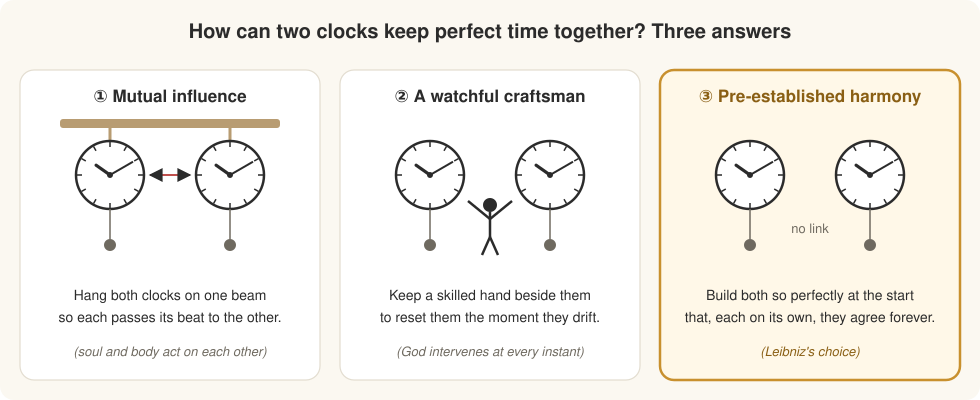
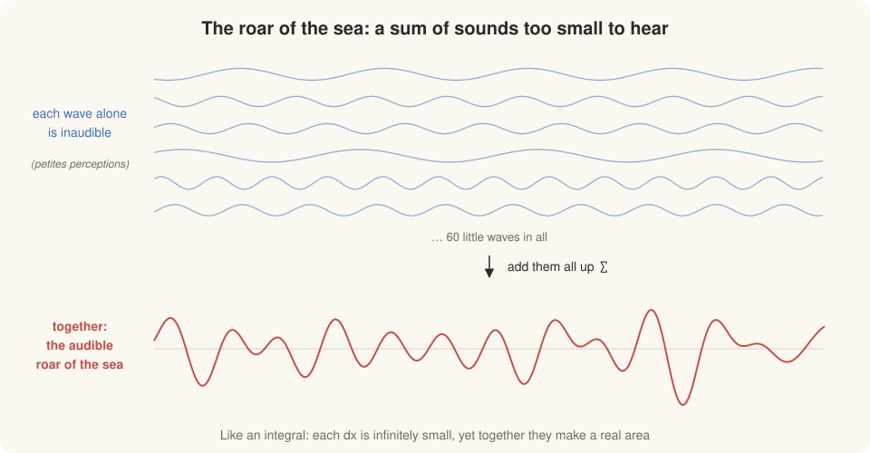
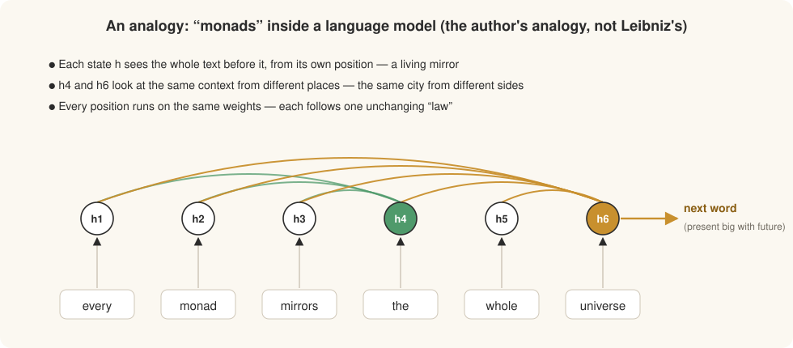

**Monads are a way to describe the behavior of a model.**

Before I can defend that sentence, I owe you a story. It is the story of a man who spent his life taming the infinitely small, and who found at the end of it that calculus was not enough. He needed a new idea to say what the world is *made of*. He wrote that idea down in ninety short paragraphs, never published it, and died two years later. Today we call those paragraphs the *Monadology*. The man was Gottfried Wilhelm Leibniz.

## Prologue: a boy in the Rosental

Leipzig, around 1661. A fifteen-year-old university student is walking alone in the Rosental, a wooded park outside the city. He is not thinking about girls or exams. He is trying to decide whether the world is made of **machines** or of **souls**.

The new philosophers (Descartes, Gassendi, Hobbes) had an exciting answer: *everything is matter in motion*. A falling stone, a beating heart, a planet: all of them are clockwork, tiny pieces pushing tiny pieces. The old philosophers, the scholastics, spoke of *substantial forms*, inner principles that make each thing the thing it is. To a bright young man in 1661 the old talk sounded dusty, and the new talk sounded like the future.

The boy chose the machines. More than fifty years later, in a letter written in 1714, the old Leibniz still remembered that walk. By then he had changed his mind. How he got there is the whole story.

## 1. Paris, and the infinitely small

In 1672 Leibniz arrived in Paris as a diplomat. He was 26 and, by his own later admission, knew very little serious mathematics. Christiaan Huygens, the greatest scientist in the city, gave him problems to work on. Leibniz devoured them.

Within three years he had found something new. In the autumn of 1675, in his private notes, he began to write a long, stretched-out S, **∫**, for *summa*, and soon afterward a small **d** for *differentia*. Take a curve. Chop it into pieces so small that they are smaller than any number you can name. The **d** measures how the curve changes over one such piece. The **∫** adds all the pieces back together. With these two symbols, problems that had taken the best minds in Europe pages of clever geometry could be done by something close to routine calculation.

He published the method in 1684, under the modest title *Nova Methodus pro Maximis et Minimis*, "A New Method for Maxima and Minima".

{#fig-nova width="60%" fig-alt="A printed Latin page headed NOVA METHODUS PRO MAXIMIS & minimis, with letters dx, dy and dv visible in the text."}

The method worked beautifully. But it left Leibniz with a question that would not go away. What *is* an infinitely small piece? If matter can be divided, and every part can be divided again, and again, forever, then where is the *thing*? Where does the world bottom out?

## 2. Looking for the true atom

Try the thought experiment yourself. Take a stone and cut it in half. Cut each half again. Keep going.

{#fig-divide fig-alt="A stone split into two, four, then sixteen pieces, with dots showing the division never ends, and a glowing point labelled monad: a true one."}

Every piece you hold still has a left side and a right side, so it can still be cut. A heap of stones is not *one* thing; it is many things that happen to be near each other. A heap of heaps is no better. If everything were only extended matter, Leibniz argued, there would be *many*s all the way down and no *one* anywhere. You cannot build a many out of nothing but many.

So somewhere there must be true units: things that are *one* in the strict sense. The only way to be truly one is to have **no parts at all**. The *Monadology* opens exactly here:

> The monad, of which we shall speak here, is nothing but a simple substance which enters into composites; *simple*, that is to say, without parts. (§1)
>
> And where there are no parts, there is neither extension, nor shape, nor divisibility possible. These monads are the true atoms of nature and, in a word, the elements of things. (§3)

He took the word from the Greek *monas*, "unit", "the one". Notice what follows from this. A monad has no size and no shape, so it cannot be a tiny speck of matter. It is not a geometric point either, because a geometric point is only a limit, a place and not a thing. Leibniz called monads *metaphysical points*: real, exact, and not in space at all.

## 3. A thing without parts, and yet it changes

This creates an immediate puzzle. If a monad has no parts, how can one monad differ from another? And how can it ever change? You cannot rearrange its pieces, because it has none.

Leibniz insisted that monads *must* differ. One of his favorite principles was that no two things in nature are perfectly alike. He liked to tell how a clever gentleman at court once walked through the gardens of Herrenhausen in Hanover, sure he could find two leaves exactly alike. The Electress Sophia bet him he couldn't. He searched for a long time and lost.

So a monad must have an inner life. Leibniz gave it two ingredients:

- **Perception**: its present state. Leibniz means "perception" in a very wide sense, not conscious seeing. It is simply the way a monad represents the many within the one, like a single point where countless lines meet.
- **Appetition**: its inner tendency to pass from one perception to the next.

Now go back to the question my draft asked at the start: *can you say it to a child, with a line or a curve?* I think you can, and I think Leibniz the mathematician would have liked the answer.

{#fig-curve fig-alt="A blue wavy curve with black dots on it and red tangent arrows at each dot. A legend says the dot is perception, the arrow is appetition, and the law of the whole curve is the monad itself."}

Think of a curve drawn by a single equation. At every moment the pen is at some **point**: that is the monad's perception right now. At every point the curve is already heading somewhere, in the direction of its **tangent**, its *d*: that is appetition. The points change and the directions change. What never changes is the **law** that generates every point and every direction. Leibniz spoke of a substance carrying "the law of the series" of all its states, and in that sense *the monad is the law itself*.

This is what I was reaching for in my first draft when I wrote that a monad is "a direction invariant under all the directions it takes". The monad is not any single state. It is what stays the same *through* all its states. That is why Leibniz could write one of the most striking lines in the book:

> Every present state of a simple substance is a natural consequence of its preceding state, so that its present is big with its future. (§22)

## 4. Walking into the mill

But why should the world's true atoms be anything like *perceivers*? Why not simply very small machines? Leibniz answered with a thought experiment that philosophers still argue about more than three hundred years later.

{#fig-mill fig-alt="A mill full of interlocking gears with a tiny person inside holding a magnifying glass and asking where the feeling is. Beside it is a card summarising section 17 of the Monadology."}

Suppose someone built a machine that could think and feel. Now enlarge it, keeping every proportion, until it is as big as a mill, and walk inside. What will you see? Gears pushing gears, levers pulling levers. You can inspect every part. Nowhere will you find the *perception* itself. A description of the parts, however complete, never contains the experience.

So, Leibniz concluded, perception must belong to what is simple, not to what is assembled. The machine can be as intricate as you like. It is the monad inside that perceives.

This is the same boy from the Rosental, fifty years on. He did not throw away the machines; he kept every bit of the new mechanical science. He simply decided that the machine is how the world *looks from outside*, and the monads are what it *is* from inside.

## 5. Windowless mirrors

Now comes the strangest claim in the book:

> Monads have no windows through which anything could come in or go out. (§7)

Nothing can enter a monad, because there is no part of it to push on and no gap to slip through. So every change it undergoes comes from within, from its own law. A monad is a closed room.

And yet each closed room contains the entire universe. Every monad perceives *everything*: every other monad, every event, near or far, clearly or dimly. Each one is, in Leibniz's phrase, **"a perpetual living mirror of the universe"** (§56). How can a room with no windows mirror the world? Leibniz's image is a city:

> Just as the same city, looked at from different sides, appears quite different and is, as it were, multiplied in perspective, so it happens that, because of the infinite number of simple substances, there are as it were so many different universes, which are nevertheless only perspectives of a single one, according to the different points of view of each monad. (§57)

{#fig-city fig-alt="Left: a top-down map of five colored buildings with an eye at north, east, south and west. Right: four panels showing the same buildings in different orders and sizes as seen from each direction."}

In the figure, nothing about the city changes between the four panels. Only the *point of view* changes, and with it which building looks tallest, which one hides behind another, which one is left and which is right. Each monad is a point of view like this. There is one universe, and infinitely many ways of being located in it.

## 6. Three clocks

This leaves an obvious problem. If no monad can affect any other, why do they agree? When I decide to raise my hand, my hand goes up. My soul and my body seem to be talking to each other. Leibniz framed the problem with two clocks, and gave three possible answers.

{#fig-clocks fig-alt="Three panels. First: two clocks hanging from a shared beam with an arrow between them. Second: two clocks with a small person standing between them. Third, highlighted: two unconnected clocks showing the same time."}

1.  **Mutual influence.** Hang both clocks on the same beam, so the swing of each disturbs the other and they fall into step. (Huygens had actually seen pendulum clocks synchronise like this.) This is the common view, that soul and body act on each other. Leibniz rejected it: monads have no windows, so there is nothing to carry the influence across.
2.  **A watchful craftsman.** Station a skilled workman beside the clocks who corrects them the moment they drift apart. This is the view of the occasionalists such as Malebranche: God adjusts the body every time the soul wills something. Leibniz found it unworthy of God, a perpetual miracle to patch up a badly made world.
3.  **Pre-established harmony.** Build both clocks so perfectly *from the very beginning* that each, following only its own mechanism, keeps time with the other forever.

The third is Leibniz's answer. God did not wire the monads together. He chose, out of all possible worlds, one in which every monad's inner law unfolds in step with every other's. Leibniz also compared it to several choirs, placed so that none can see or hear the others, each singing only from its own score, and yet the music agrees perfectly.

## 7. The roar of the sea

If every monad mirrors the whole universe, why don't *I* perceive everything? Because, Leibniz said, most perception is too small to notice. He used an image from the seashore, in his *New Essays*:

When you stand by the sea, you hear its roar. That roar is made of the sound of each individual wave. You could never hear one wave by itself. Yet you must hear each one a little, for a hundred thousand nothings could never add up to something.

{#fig-waves fig-alt="Six thin blue sine waves stacked at the top, labelled as each inaudible alone, an arrow labelled add them all up, and a single large red wave below labelled the audible roar of the sea."}

These are the **petites perceptions**, the little perceptions. And here you can see the mathematician again. This is *exactly* the logic of the integral. Each *dx* is smaller than anything you can measure, yet ∫ of them gives a real, finite area. For Leibniz, a conscious experience is the integral of countless unconscious ones. "Nature never makes leaps," he liked to say. There is no sharp line between a stone and a mind, only a continuous ladder:

| Kind of monad | What it has | Example |
|------------------------|------------------------|------------------------|
| Bare monad | Perception, but all of it confused and too small to notice | the monads in a stone or a plant |
| Soul | Perception distinct enough to include feeling and memory | animals |
| Spirit (rational soul) | Reason, self-awareness, knowledge of necessary truths | human beings |
| The supreme monad | Perception of everything, perfectly distinct | God |

Every monad mirrors the same universe. They differ only in how *clearly* they mirror it, like the same painting seen through glass of different thickness.

## 8. Vienna, 1714

Now let us return to where we began.

Leibniz is sixty-eight. For decades he has served the House of Brunswick in Hanover as librarian, historian, engineer, and advisor. He has built one of the first calculating machines able to multiply, worked out binary arithmetic, and tried to drain the silver mines of the Harz with windmills. He is now stuck in Vienna, and his reputation is falling apart: in 1712 a committee of the Royal Society, quietly steered by Newton, had declared that Newton invented the calculus first, implying Leibniz had stolen it.

In this year he writes to a French correspondent, Nicolas Remond, and remembers the boy in the Rosental. In the same year he writes, in French, a short text of ninety numbered paragraphs, never meant as a book, just a summary of his philosophy for friends. It has no title. Later editors call it the *Monadology*. It is not published in his lifetime; a German translation appears in 1720, four years after his death in Hanover in 1716, largely neglected by the court he had served for forty years.

What had that long road taught him? That the fifteen-year-old was half right. The world *is* a machine, down to the smallest detail, and physics should describe it as one. But a machine is only how things look from outside. From inside, the world is made of **points of view**: simple, windowless, each following its own law, each mirroring everything, all in harmony because they were made to be.

## Epilogue: monads for a child, and for a model

If I had to tell a child, I would say it like this:

> Imagine the whole world is made of tiny rooms with no windows and no doors. In every room there is a magic mirror, and in the mirror you can see the *whole* world, but only from the spot where that room stands. Nobody can pass notes between rooms. Still, every room's mirror shows the same story at the same moment, because the one who built the rooms wound them all up just right at the very beginning.

And now I can come back to my first sentence: *monads are a way to describe the behavior of a model.* Look at how a language model reads a sentence.

{#fig-model fig-alt="Six word tokens, every monad mirrors the whole universe, each feeding a hidden state h1 to h6. Curved lines connect earlier states to h4 in green and to h6 in gold, and h6 has an arrow to the next word."}

Each position in the sequence has a hidden state. That state is, in a precise sense, a representation of the *whole* context seen from *one place*: a living mirror of everything that came before. Two positions look at the same text and hold very different pictures of it, like the city seen from the north and from the east. Every position runs the same weights, the same unchanging law, and the next word comes out of the current state: *the present is big with the future*.

The analogy is far from perfect. Attention is precisely a window, and Leibniz's monads have none. Working out where the analogy holds and where it breaks is what the next posts are about. But I think the old question from Leipzig and Vienna, *what is the one thing that stays the same while every state changes?*, is also the right question to ask about a model.

## Further reading

- G. W. Leibniz, *The Monadology* (1714). Robert Latta's 1898 English translation is in the public domain and widely available online.
- G. W. Leibniz, *New Essays on Human Understanding* (written c. 1704), especially the preface, for the little perceptions and the roar of the sea.
- Maria Rosa Antognazza, *Leibniz: An Intellectual Biography* (Cambridge University Press, 2009).
- Nicholas Rescher, *G. W. Leibniz's Monadology: An Edition for Students* (University of Pittsburgh Press, 1991).
- Brandon C. Look, "Gottfried Wilhelm Leibniz", *Stanford Encyclopedia of Philosophy*.