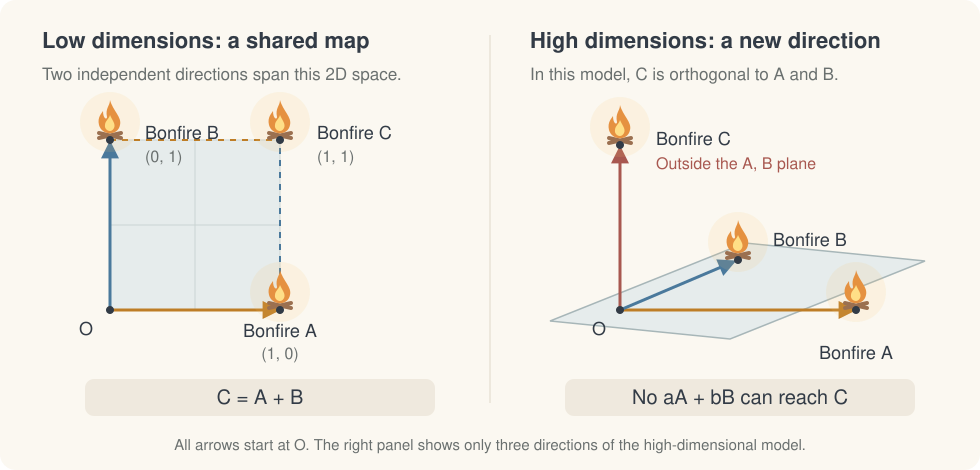
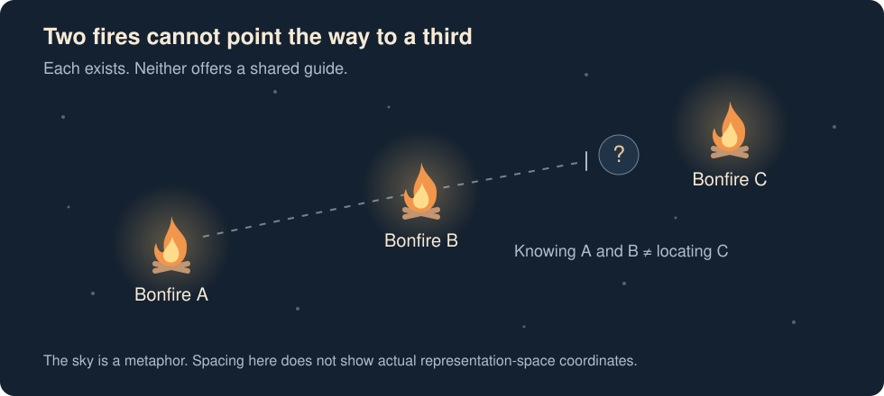
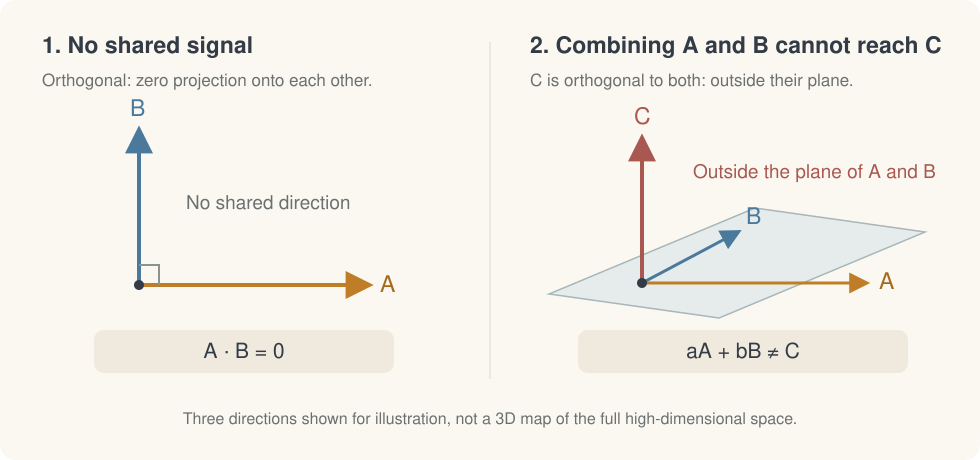

Imagine an endless night sky scattered with bonfires. Each one burns, but its light never reaches another. **I call this kind of high-dimensional representation space *bonfire space*.**

## A shared map in low dimensions

Start with three bonfires on a flat, two-dimensional map. Measure their positions from the same origin: A is one step east, B is one step north, and C is one step east **and** one step north. In coordinates, A = (1, 0), B = (0, 1), and C = (1, 1), so **C = A + B**.

Two independent directions cover this whole map. Once a third fire's coordinates are given, you can describe how to reach it using those same directions. Knowing A and B alone does not tell you where an unknown C is; they give you a shared language for locating it.

{#fig-bonfire-dimensions fig-alt="A comparison of two bonfire arrangements. Left: from a common origin, bonfire A is at (1,0), B at (0,1), and C at (1,1). Dashed steps show C equals A plus B. Right: A and B lie in a shaded plane, while bonfire C stands along a third direction outside it. Only three directions of the high-dimensional model are shown."}

## Independent directions in bonfire space

A bonfire's “location” is a direction in representation space, rather than a place you can mark with three ordinary spatial coordinates. A high-dimensional space has room for many independent directions. Each bonfire shines along its own.

{#fig-bonfire-universe fig-alt="Three bonfires, A, B, and C, glow in a dark sky. A dotted route from A through B stops at a question mark without reaching C. Their spacing is a metaphor, not actual coordinates."}

Here, “far apart” means **orthogonal: one bonfire's direction has no projection onto another's.** They share no direction that could serve as a guide from one to the other.

Try to read one through the other by taking their inner product, and the result is zero. This is the “nothingness” of bonfire space: no shared signal. Even combining the two directions leaves you within the space they span. You cannot reach a third bonfire whose direction is orthogonal to both.

{#fig-bonfire-directions fig-alt="Left: perpendicular arrows A and B, labelled A dot B equals zero. Right: A and B span a shaded plane, while C points out of it, labelled aA plus bB does not equal C. This illustrates direction relationships, not a three-dimensional map of the full space."}

The difference is that two independent directions span the entire 2D map, while a third bonfire in this model lies beyond the first two directions. High dimensionality makes room for many such directions; **mutual orthogonality is the assumption that keeps the fires separate.**

**Every bonfire burns. None gives directions to the others.**